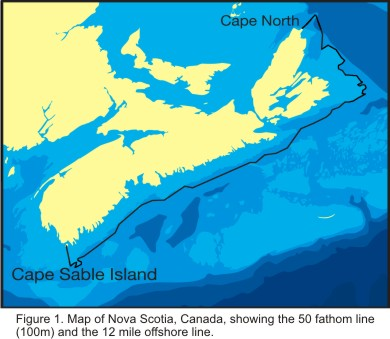

```{r setup, include=FALSE}
library(plotly)
library(crosstalk)
library(ggplot2)
library(DT)
library(leaflet)
data <- read.csv("RV2010_2018.csv")
data <- data[which(data$SPEC %in% c(10, 30, 2550)), ]
data$COMM <- factor(data$COMM)
shared_data <- SharedData$new(data)
```

Project {data-icon="fa-laptop"}
=======================================

Column {.tabset}
---------------------------------------

### Project 

<div style="float: right; width: 19%; padding-left: 1%;">


```{r, out.width = "100%"}

```

</div>  
    
<div style="float: right; width: 80%;">

**DFO/FSRS INSHORE ECOSYSTEM RESEARCH ON THE SCOTIAN SHELF 2005-2007**  

https://fsrsns.ca/dfo-fsrs-inshore-ecosystem-research-on-the-scotian-shelf/

C.E. den Heyer, A. Bundy, C. MacDonald et al.

#### Project Summary

The Department of Fisheries and Oceans (DFO) undertook an ecosystem approach to oceans management which included the Eastern Scotian Shelf Integrated Management (ESSIM) initiative and the development of methods for the identification of Ecologically and Biologically Significant Areas (EBSAs). Inshore areas are critical nursery and feeding areas for many marine species, but we have insufficient scientific data to meaningfully contribute to either Integrated Management of the inshore or definitions of EBSAs. The Inshore Ecosystem Research Project is a joint project between the Fishermen and ecoScientists Research Society (FSRS) and DFO. The DFO/FSRS Inshore Ecosystem Research on the Scotian Shelf project, funded under Phase 1 of the Oceans Action Plan, aims to fill this data gap to the extent possible. This project relied heavily upon the participation of inshore fishermen for both the local ecological knowledge survey and the collection of new data. FSRS fishermen members were involved in the design of the project and were critical to the successful completion of the project.

#### Objectives

This project brought together existing data and knowledge from a range of sources, including local ecological knowledge surveys of commercial fishermen, and the collection of new data, on the use of the inshore by marine and diadromous fish, marine mammals, invertebrates, and marine plants and their habitat associations. The geographical scope of the proposed project was the inshore area of the Scotian Shelf (Figure 1), from Cape North to Cape Sable Island.

This project began with the collection of baseline research on the distribution and relative abundance of marine and diadromous fish, marine mammals, invertebrates and marine plants by surveying existing scientific literature and data; conducting a local ecological knowledge survey; and by conducting at-sea catch analysis during commercial fishing activities. The second year of the project involved fisheries-independent research to describe the distribution of species along the Atlantic coast of Nova Scotia out to 50 fathoms. This provided a degree of ground-truthing for the baseline information and provided more detailed data to identify geographic gradients, habitat and species associations, and candidate EBSAs. By April 2007, a draft Ecosystem Overview and Assessment Report (EOAR) for the Inshore of the Scotian Shelf was created, which contributed to the development of a strategic research plan in support of Phase 2 of the Oceans Action Plan.

### Publications available 


1. Inshore Scotian Shelf Ecosystem Overview Report
Bundy, A., Themelis, D., Sperl, J. and den Heyer, N. 2014. Inshore Scotian Shelf Ecosystem Overview Report: Status and Trends. DFO Can. Sci. Advis. Sec. Res. Doc. 2014/065. xii + 213 p
http://waves-vagues.dfo-mpo.gc.ca/Library/360197.pdf


2. DFO/FSRS Inshore Ecosystem Project Data Synthesis Workshop; 19-20 March 2007. DFO Can. Sci.
Advis. Sec. Proceed. Ser. 2007/028.
http://publications.gc.ca/collections/collection_2011/mpo-dfo/Fs70-4-2007-028-eng.pdf


3. DFO/FSRS Local Ecological Knowledge Survey Preliminary Report – July 2009
https://fsrsns.files.wordpress.com/2018/02/2-pager_15-july-09_final.pdf


4. DFO/FSRS Inshore Ecosystem Research on the Scotian Shelf Year End Report, October 2005 to March 2006
https://fsrsns.files.wordpress.com/2018/02/2005-06inshoreecosystemjpafinal-report.pdf


5. At-Sea Catch Analysis of Inshore Scotian Shelf Lobster Fishery and 4VsW Commercial Index (Canadian Technical Report 2890)
https://fsrsns.files.wordpress.com/2018/02/342236.pdf


6. DFO-FSRS LEK Study – Interview Instrument Phase 1
https://fsrsns.files.wordpress.com/2018/02/tier-1-survey-instrument.pdf


7. DFO-FSRS LEK Study – Interview Instrument Phase 2
https://fsrsns.files.wordpress.com/2018/02/tier-2-survey-instrument.pdf


Map {data-icon="fa-map"}
=======================================

Column {.sidebar}
-------------------------------------

### Inputs

```{r}

filter_select("MISSION", "Mission", shared_data, ~MISSION)
filter_select("COMM", "Species", shared_data, ~COMM)

```


Column {.tabset}
-------------------------------------

### Map connected to filters

```{r}

p <- plot_geo(data = shared_data, x = ~LONGITUDE, y = ~LATITUDE, color = ~COMM,
              size = ~TOTWGT, sizes = c(10, 500),
              colors = viridis::viridis(3)) %>%  
  add_markers() %>%                                       
  layout(geo = list(resolution = 50,                      
                    showland = TRUE,                      
                    landcolor = toRGB("grey90"),          
                    coastlinecolor = toRGB("grey80"),
                    projection = list(type = "mercator"),    
                    lonaxis = list(range = c(-75, -45)),    
                    lataxis = list(range = c(40, 50))))
p
```

### Leaflet map

```{r}

leaflet(shared_data) %>%
  addTiles() %>%
  addCircleMarkers(stroke = FALSE,
                   fillOpacity = 0.5, radius = 3,
                   color = ~viridis::viridis(3)[factor(COMM)])

```


Plots {data-icon="fa-signal"}
=======================================

Column
-------------------------------------

### Temperature

```{r}
plot_ly(data = shared_data) %>% 
  add_markers(x = ~BOTTOM_TEMPERATURE, y = ~SURFACE_TEMPERATURE,
              color = ~COMM, colors = viridis::viridis(3),
              size = ~TOTWGT, sizes = c(10, 500)) %>% 
  highlight(persisten = TRUE, off = "plotly_relayout")

```

> Markers sized based on total weight captured


Data {data-icon="fa-database"}
=======================================

Column
-------------------------------------

### Results

```{r}
DT::datatable(shared_data, extensions = 'Buttons', 
              options = list(dom = 'Bfrtip',
                             buttons = c('csv', 'excel'))) 
```

